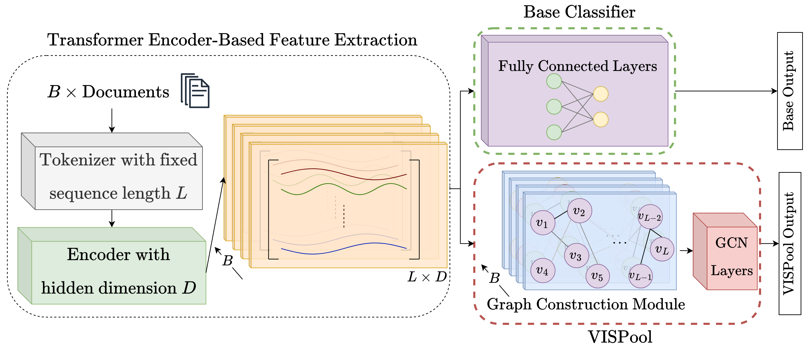

# VISPool


[](https://pytorch.org/)
[](https://lightning.ai/)
[](https://wandb.ai/tunakasif/vispool)
[](./LICENSE)

Codebase for the paper _VISPool: Enhancing Transformer Encoders with Vector Visibility Graph Neural Networks_, submitted to _ACL ARR February 2024_.

## TL;DR

We propose a vector visibility-based dynamic graph construction method for text documents and a corresponding _VISPool_ architecture that allows seamless integration of transformers and graph neural networks.



## Abstract

The emergence of transformers has revolutionized natural language processing (NLP), as evidenced in various NLP tasks. While graph neural networks (GNNs) show recent promise in NLP, they are not standalone replacements for transformers. Rather, recent research explores combining transformers and GNNs. Existing GNN-based approaches rely on static graph construction methods requiring excessive text processing, and most of them are not scalable with the increasing document and word counts. We address these limitations by proposing a novel dynamic graph construction method for text documents based on vector visibility graphs (VVGs) generated from transformer output. Then, we introduce visibility pooler (VISPool), a scalable model architecture that seamlessly integrates VVG convolutional networks into transformer pipelines. We evaluate the proposed model on the General Language Understanding Evaluation (GLUE) benchmark datasets. VISPool outperforms the baselines with less trainable parameters, demonstrating the viability of the visibility-based graph construction method for enhancing transformers with GNNs.


## Vector Visibility Graph Dependency

Vector visibility graph (VVG) is a novel approach that maps mutlivariate time series into a graph structure. For this project @tunakasif implemented [`vector-vis-graph`](https://github.com/tunakasif/vector-vis-graph/) for fast and parallel VVG generation. Due to its promising applications, it is implemented as a standalone library, which is used as an external dependency in this project. For details, please refer to its own [GitHub page](https://github.com/tunakasif/vector-vis-graph/). It is also available on [`PyPI`]():

```bash
pip install vector-vis-graph
```

and [`Conda`]():

```bash
conda install -c conda-forge vector-vis-graph
```

## Installation

### As a Dependency

It is possible to install this project as a dependency from the GitHub repository, either with `pip`:

```bash
pip install git+https://github.com/koc-lab/vispool
```

or with `Poetry`:

```bash
poetry add git+https://github.com/koc-lab/vispool
```

### Development or Altering Behavior

After cloning the repository, install the required dependencies either from pinned versions in the [`requirements.txt`](./requirements.txt) file:

```bash
pip install -r requirements.txt
```

or with `Conda` through [`environment.yml`](./environment.yml):

```bash
conda env create --name vispool --file=environment.yml
```

or with `Poetry` by running the following command in the root directory:

```bash
poetry update
```

## Project Structure

The [`vispool/glue/`](./vispool/glue/) directory contains the baseline code for data loading, training and evaluating transformers on the GLUE benchmark datasets. Datasets and their corresponding metrics are obtained from the Hugging Face's `datasets` and `evaluate` modules. Base transformers are obtained from the Hugging Face's `transformers` library. To eliminate boilerplate code and to have reproducible experiments with auto accelerators, the `lightning` library is used for data loading and training. Finally, for logging and tracking, the `wandb` library is used.

The [`vispool/model/`](./vispool/model/) directory contains the proposed VVG-based GCN architecture and the overall VISPool model that integrates the transformer and the VVG-based GCN. Similar structure to the baseline is preserved for easy integration and comparison.

Finally, [`vispool/baseline.py`](./vispool/baseline.py) and [`vispool/our.py`](./vispool/our.py) are used to define the hyperparameter tuning sweeps for the baseline and the proposed model, respectively. It allowed easy integration and agent attachment to the WandB sweeps. With `click` library, a CLI is implemented for easy usage of the sweeps and the agents in [`vispool/__main__.py`](./vispool/__main__.py).

## Usage

```bash
Usage: python -m vispool [OPTIONS] COMMAND [ARGS]...

Options:
  --help  Show this message and exit.

Commands:
  baseline-sweep        Initialize a WandB sweep for fine-tuning a baseline transformer model
                        generated from MODEL_CHECKPOINT on a GLUE task with name TASK_NAME.
  baseline-agent        Attach an agent to the created baseline sweep with the given SWEEP_ID.
  vispool-sweep         Initialize a WandB sweep for fine-tuning a vispool model generated
                        from MODEL_CHECKPOINT on a GLUE task with name TASK_NAME.
  vispool-agent         Attach an agent to the created vispool sweep with the given SWEEP_ID.
  vispool-single-sweep  Initialize a WandB grid sweep for different seeds with the
                        hyperparameter values obtained in the given run with the specified
                        RUN_ID.
  vispool-single-agent  Attach an agent to the created vispool single sweep with the given SWEEP_ID
```

### Example: Creating a Sweep for VISPool and Attaching an Agent

First create a sweep for the VISPool model for a GLUE benchmark dataset with a given `TASK_NAME` and an initial `MODEL_CHECKPOINT` which can be any path or name accepted by the Hugging Face's `AutoModel` class. For example, to create a sweep for the MRPC dataset with the `distilbert-base-uncased` checkpoint:

```bash
python -m vispool vispool-sweep "distilbert-base-uncased" "mrpc"
```

This will output the created `SWEEP_ID`:

```stdout
Created sweep with id: a1b2c3d4
```

Then attach an agent to the created sweep with the given `SWEEP_ID`:

```bash
python -m vispool vispool-agent a1b2c3d4
```

